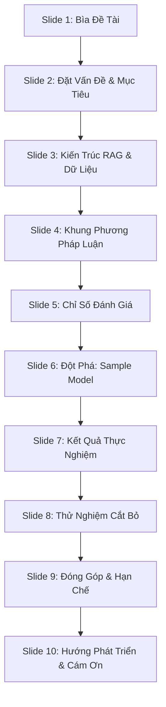

# DÀN Ý CHI TIẾT CHO CẤU TRÚC SLIDE MỚI (BẢO VỆ ĐỒ ÁN)
**Tên đề tài:** Xây dựng Chatbot Thư viện Điện tử Tiếng Việt (VietLib RAG)
**Sinh viên thực hiện:** [Họ và tên] - [MSSV] | **GVHD:** TS. Lê Kim Thư

---

## 📊 TỔNG QUAN PHÂN BỔ 10 SLIDE

---

## CHI TIẾT NỘI DUNG VÀ LỜI THOẠI CHO TỪNG SLIDE

### SLIDE 1: BÌA ĐỀ TÀI & THÔNG TIN CHUNG
*   **Nội dung hiển thị trên slide:**
    *   Logo Trường Công nghệ Thông tin và Truyền thông - ĐHBK Hà Nội (HUST).
    *   **Tên Đề tài:** XÂY DỰNG CHATBOT THƯ VIỆN ĐIỆN TỬ TIẾNG VIỆT
    *   **Phụ đề:** Phát triển Hệ RAG Đa chế độ và Đánh giá Đa tiêu chí trên Tập Đối chứng (Controlled Benchmark)
    *   **Sinh viên thực hiện:** [Họ và tên] - [MSSV] - Lớp Toán-Tin.
    *   **Giảng viên hướng dẫn:** TS. Lê Kim Thư.
*   **Lời thoại thuyết minh:**
    > *"Kính thưa thầy cô trong Hội đồng bảo vệ đồ án tốt nghiệp. Em tên là [Họ và tên]. Hôm nay, em xin phép trình bày đề tài đồ án tốt nghiệp của mình: 'Xây dựng Chatbot Thư viện Điện tử Tiếng Việt'. Đồ án tập trung vào hai nhánh chính: Một là phát triển một hệ chatbot hỏi-đáp văn học ứng dụng kiến trúc RAG nâng cao, và hai là đề xuất một phương pháp luận đánh giá toàn diện sử dụng tập đối chứng."*

---

### SLIDE 2: ĐẶT VẤN ĐỀ & MỤC TIÊU ĐỀ TÀI
*   **Nội dung hiển thị trên slide:**
    *   **Thực trạng:** 
        *   Tìm kiếm sách văn học truyền thống chỉ dựa trên từ khóa thô sơ $\rightarrow$ Thất bại khi người dùng tìm theo ý nghĩa, cảm xúc hay tóm tắt cốt truyện.
        *   Dùng các mô hình ngôn ngữ lớn (LLM) phổ thông $\rightarrow$ Bị **ảo tưởng (hallucination)** nặng về thông tin văn học Việt Nam (bịa nội dung, sai tác giả/năm).
    *   **Mục tiêu đồ án:**
        *   Phát triển Chatbot hỏi-đáp tiếng Việt đáng tin cậy: **100% trả lời dựa trên kho tri thức xác thực**, có trích dẫn nguồn.
        *   Thiết kế cơ chế chống ảo tưởng thông minh (từ chối lịch sự khi ngoài phạm vi).
*   **Lời thoại thuyết minh:**
    > *"Động lực nghiên cứu của đề tài xuất phát từ một thực trạng kép. Thứ nhất, việc tìm kiếm tư liệu văn học bằng từ khóa truyền thống không đáp ứng được nhu cầu tra cứu theo ý nghĩa ngữ nghĩa của độc giả. Thứ hai, nếu dùng trực tiếp các LLM phổ thông như ChatGPT, mô hình rất dễ bị ảo tưởng, bịa đặt thông tin do thiếu dữ liệu huấn luyện tiếng Việt chuyên sâu. 
    > Vì vậy, mục tiêu của đồ án là xây dựng một hệ thống RAG giúp chatbot trả lời hoàn toàn dựa vào kho tri thức kiểm soát được, đồng thời thiết lập cơ chế tự động từ chối thông tin ngoài miền để đảm bảo tính trung thực tối đa."*

---

### SLIDE 3: KIẾN TRÚC HỆ THỐNG & PIPELINE DỮ LIỆU
*   **Nội dung hiển thị trên slide:**
    *   **Sơ đồ luồng (Pipeline RAG):**
        $$\text{User Query} \rightarrow \text{Hybrid Retrieval (BM25 + Dense Qdrant)} \rightarrow \text{RRF Fusion} \rightarrow \text{Cross-Encoder Rerank} \rightarrow \text{Gemini 2.5}$$
    *   **Kho tri thức (Corpus):** **11.759 chunks** dữ liệu thực tế (đã cào, làm sạch, phân mảnh câu).
    *   **Làm giàu siêu dữ liệu (Metadata Enrichment):** Gán thông tin *Tác giả, Năm xuất bản, Thể loại* bằng cách kiểm chứng chéo với Wikidata.
*   **Lời thoại thuyết minh:**
    > *"Đây là kiến trúc tổng thể của hệ thống. Khi người dùng nhập câu hỏi, hệ thống thực hiện truy hồi lai (Hybrid): kết hợp BM25 để bắt từ khóa nhanh và Dense Retrieval (sử dụng vector nhúng lưu trữ trên Qdrant DB) để tìm kiếm ngữ nghĩa. 
    > Hai kết quả được hợp nhất bằng thuật toán RRF và tái xếp hạng bằng mô hình Cross-Encoder trước khi gửi tới Gemini 2.5 Flash sinh câu trả lời kèm trích dẫn. Đặc biệt, kho dữ liệu gồm 11.759 chunk này đã được em làm giàu siêu dữ liệu (metadata) bằng cách đối chiếu chéo Wikidata, giúp chatbot trả lời được cả các câu hỏi thuộc tính như năm sáng tác hay thể loại."*

---

### SLIDE 4: PHƯƠNG PHÁP LUẬN ĐÁNH GIÁ ĐA TIÊU CHÍ
*   **Nội dung hiển thị trên slide:**
    *   **Hợp nhất 3 Khung Tham Chiếu:**
        1.  **Khung A (OMICall):** chatbot dưới góc nhìn **Sản phẩm & Vận hành** (Độ trễ, sự tương tác, hiệu năng NLP).
        2.  **Khung B (GeeksforGeeks):** hệ RAG dưới góc nhìn **Kỹ thuật** (đo riêng biệt khâu Truy hồi và khâu Sinh).
        3.  **Khung C (Microsoft):** hệ chatbot doanh nghiệp dưới góc nhìn **Thực chiến** (Độ ổn định, bộ nhớ hội thoại, red-teaming an toàn).
    *   **Bộ ba RAG Triad làm lõi:** Context Relevance $\rightarrow$ Groundedness (Faithfulness) $\rightarrow$ Answer Relevance.
*   **Lời thoại thuyết minh:**
    > *"Để đánh giá một cách khoa học hiệu năng của chatbot RAG, đồ án không đi theo một metric đơn lẻ mà đề xuất một khung phương pháp luận thống nhất. Em hợp nhất 3 khung tham chiếu: OMICall cho góc nhìn sản phẩm, GeeksforGeeks cho chất lượng kỹ thuật của RAG, và khung của Microsoft cho tính thực chiến và an toàn của hệ thống. Cốt lõi của đánh giá xoay quanh bộ ba RAG Triad nhằm đảm bảo kiểm soát chất lượng ở mọi điểm chạm của luồng xử lý thông tin."*

---

### SLIDE 5: CÁC CHỈ SỐ ĐÁNH GIÁ KỸ THUẬT CHI TIẾT
*   **Nội dung hiển thị trên slide:**
    *   **Nhóm Truy hồi (Retrieval):**
        *   *Precision@K & Recall@K:* Đo tỷ lệ chính xác và độ bao phủ của tài liệu lấy về.
        *   *MRR (Mean Reciprocal Rank):* Đo vị trí của tài liệu đúng đầu tiên (vô cùng quan trọng với RAG).
        *   *nDCG@K:* Đánh giá thứ hạng có xét đến mức độ liên quan.
        *   *MAP@K:* Đo chất lượng xếp hạng trung bình.
    *   **Nhóm Sinh & Đầu-cuối (Generation & End-to-End):**
        *   *Faithfulness (Groundedness):* Đo tỷ lệ câu trả lời hoàn toàn dựa trên ngữ cảnh (Hallucination Rate = 0%).
        *   *Citation Accuracy:* Độ chính xác của các nhãn trích dẫn nguồn.
        *   *Fallback Rate:* Khả năng từ chối đúng khi gặp câu hỏi ngoài phạm vi.
*   **Lời thoại thuyết minh:**
    > *"Ở khâu kỹ thuật, em chia bộ tiêu chí thành 2 nhóm lớn. Nhóm Truy hồi đánh giá chất lượng tìm kiếm bằng 5 metric tiêu chuẩn học thuật, trong đó chú trọng chỉ số MRR và nDCG để đảm bảo tài liệu tốt nhất nằm ở vị trí cao nhất. 
    > Nhóm Sinh và Đầu-cuối đánh giá chất lượng trả lời của mô hình ngôn ngữ, đo lường độ trung thực thông qua chỉ số Faithfulness, độ chính xác của trích nguồn (Citation Accuracy) và tỷ lệ nhận diện câu hỏi ngoài phạm vi để kích hoạt cơ chế từ chối (Fallback)."*

---

### SLIDE 6: SỰ CẦN THIẾT CỦA "SAMPLE MODEL" (TẬP ĐỐI CHỨNG)
*   **Nội dung hiển thị trên slide:**
    *   **Hạn chế của Hệ thống lớn (11.759 chunk):**
        *   Không thể biết toàn bộ các tài liệu liên quan cho mỗi câu hỏi $\rightarrow$ Chỉ tính được **Recall xấp xỉ**.
        *   nDCG buộc phải dùng nhãn nhị phân (0 hoặc 1).
        *   Khâu sinh chỉ có thể đánh giá thủ công trên tập nhỏ.
    *   **Giải pháp: Sample Model (Tập đối chứng chuẩn hóa):**
        *   *Quy mô dữ liệu:* **163 chunk** sạch 100% từ 51 tác phẩm tiêu biểu.
        *   *Golden Set:* **32 câu hỏi** thiết kế đa dạng dạng bài.
        *   *Nhãn phân cấp (Graded Relevance 0/1/2):* Cho phép tính **nDCG chuẩn** và **Recall thực tế**.
        *   *Ground-truth answers:* Hỗ trợ chạy tự động **LLM-as-a-judge (RAGAS)**.
*   **Lời thoại thuyết minh:**
    > *"Tuy nhiên, trong thực tiễn nghiên cứu RAG, việc đo lường trên corpus lớn gặp giới hạn vì chúng ta không thể gán nhãn thủ công cho hàng vạn chunk dữ liệu, khiến Recall đo được chỉ là xấp xỉ và không đo được tự động khâu sinh. 
    > Vì thế, em đã xây dựng một Sample Model làm tập đối chứng chuẩn hóa. Với quy mô 163 chunk sạch tuyệt đối và bộ Golden Set 32 câu hỏi được gán nhãn phân cấp chi tiết 0/1/2 cùng câu trả lời mẫu, chúng em đã đo được Recall thực tế, nDCG chuẩn học thuật và áp dụng thành công đánh giá tự động bằng LLM làm giám khảo thông qua framework RAGAS."*

---

### SLIDE 7: KẾT QUẢ THỰC NGHIỆM TRÊN HỆ CHÍNH VÀ SAMPLE MODEL
*   **Nội dung hiển thị trên slide:**
    *   **Bảng so sánh 4 cấu hình truy hồi (Hệ chính):**
        *   Vector search thuần có MRR rất thấp (0.45) do yếu tố tên riêng tiếng Việt.
        *   Hybrid + Rerank đạt kết quả tốt nhất: **P@1 = 83.3%**, **MRR = 0.887**.
    *   **Kết quả đo đạc trên Sample Model (Tập đối chứng):**
        *   *Truy hồi:* MRR = 0.946, HitRate@3 = 100%, **Recall@10 thật = 87.3%**, nDCG@10 graded = 0.839.
        *   *Sinh:* Faithfulness = 0.95 - 0.99, Answer Relevance = 1.00, Citation Accuracy = 100%.
*   **Lời thoại thuyết minh:**
    > *"Bảng kết quả thực nghiệm trên hệ chính chứng minh tính đúng đắn của việc lựa chọn kiến trúc Hybrid khi MRR đạt 0.887, vượt trội hơn hẳn Vector search thuần. 
    > Trên tập đối chứng Sample Model, nhờ chất lượng dữ liệu sạch và nhãn phân cấp, các chỉ số đạt độ chính xác rất cao: MRR đạt 0.946, Recall thật đo được đạt 87.3%. Về mặt sinh, chỉ số Faithfulness của RAGAS đạt từ 0.95 đến 0.99, khẳng định hệ thống gần như không có hiện tượng ảo tưởng thông tin."*

---

### SLIDE 8: THỬ NGHIỆM CẮT BỎ (ABLATION STUDY) & ĐÁNH GIÁ AN TOÀN
*   **Nội dung hiển thị trên slide:**
    *   **Thử nghiệm cắt bỏ (Ablation Study):**
        *   Đo lường tác động của mô hình nhúng (Embedding Model) trên cùng tập đối chứng.
        *   Kết quả Vector P@1: Model đa ngôn ngữ MiniLM (**0.43**) $\rightarrow$ Model chuyên dụng tiếng Việt BGE-M3 (**0.89**).
    *   **Đánh giá an toàn & Fallback (Red-teaming):**
        *   Hệ thống chặn thành công 10/10 câu hỏi ngoài phạm vi (cách nấu ăn, Naruto, Harry Potter...).
        *   Ngưỡng chặn RRF < 0.003 triệt tiêu hoàn toàn câu trả lời bịa đặt.
*   **Lời thoại thuyết minh:**
    > *"Để làm rõ hơn đóng góp của từng thành phần công nghệ, em đã tiến hành một thử nghiệm cắt bỏ. Khi thay đổi mô hình nhúng MiniLM sang mô hình tiếng Việt chuyên dụng BGE-M3, Precision@1 của tìm kiếm vector tăng vọt từ 43% lên 89%. Thử nghiệm này chứng minh việc nâng cấp mô hình nhúng sẽ cải thiện đáng kể khâu truy hồi ngữ nghĩa. 
    > Đồng thời, qua thử nghiệm tấn công dò lỗi an toàn (Red-teaming) bằng các câu hỏi ngoài phạm vi, hệ thống đã chặn thành công 100% các câu hỏi không liên quan, thực hiện từ chối trả lời đúng kịch bản nhờ ngưỡng chặn RRF 0.003."*

---

### SLIDE 9: ĐÓNG GÓP CHÍNH VÀ HẠN CHẾ CỦA ĐỒ ÁN
*   **Nội dung hiển thị trên slide:**
    *   **Đóng góp chính:**
        *   **Về mặt sản phẩm:** Chatbot RAG hoàn thiện chạy thực tế trên dữ liệu văn học Việt Nam, chống ảo tưởng bằng trích nguồn rõ ràng.
        *   **Về mặt phương pháp luận:** Xây dựng thành công khung đánh giá đa tiêu chí và quy trình thiết lập tập đối chứng (Sample Model) để giải quyết bài toán đo Recall thật và nDCG graded.
    *   **Hạn chế:**
        *   Chi phí thời gian sinh câu trả lời phụ thuộc API Gemini bên ngoài.
        *   Chưa thực hiện đánh giá chéo trên quy mô lớn của nhiều người chấm (Human annotators).
*   **Lời thoại thuyết minh:**
    > *"Nhìn lại quá trình thực hiện, đồ án đạt được hai đóng góp lớn. Về sản phẩm, chúng em đã chạy thành công một hệ chatbot RAG văn học Việt Nam thực tế, giải quyết được bài toán ảo tưởng thông tin. Về học thuật, đồ án đề xuất và hiện thực hóa được quy trình đo Recall thật và nDCG graded thông qua tập đối chứng Sample Model. 
    > Tuy nhiên, hệ thống vẫn có hạn chế là thời gian phản hồi đầy đủ còn chậm do phụ thuộc vào API Gemini và chưa đo lường được độ đồng thuận giữa các chuyên gia chấm điểm con người."*

---

### SLIDE 10: HƯỚNG PHÁT TRIỂN & LỜI CẢM ƠN
*   **Nội dung hiển thị trên slide:**
    *   **Hướng phát triển:**
        *   Ứng dụng mô hình nhúng BGE-M3 cho hệ thống dữ liệu lớn.
        *   Mở rộng đánh giá chéo giữa nhiều chuyên gia con người (đo độ đồng thuận Fleiss' Kappa).
        *   Tự host mô hình LLM mã nguồn mở phục vụ tiếng Việt tốt để tăng tính bảo mật và giảm độ trễ.
    *   **Lời cảm ơn:**
        *   Bày tỏ lòng cảm ơn chân thành tới giảng viên hướng dẫn TS. Lê Kim Thư và Hội đồng đánh giá.
        *   *Q&A:* Sẵn sàng nhận câu hỏi chất vấn.
*   **Lời thoại thuyết minh:**
    > *"Để khắc phục những hạn chế đó, hướng phát triển tiếp theo của đồ án là nâng cấp mô hình nhúng của hệ thống chính lên BGE-M3, mở rộng đánh giá chéo giữa nhiều con người và nghiên cứu tự host mô hình ngôn ngữ lớn để giảm độ trễ phản hồi. 
    > Đến đây, em xin phép kết thúc phần trình bày của mình. Em xin chân thành cảm ơn TS. Lê Kim Thư đã tận tình hướng dẫn và cảm ơn các thầy cô trong Hội đồng đã dành thời gian lắng nghe. Em rất mong nhận được những câu hỏi và ý kiến đóng góp từ thầy cô."*
