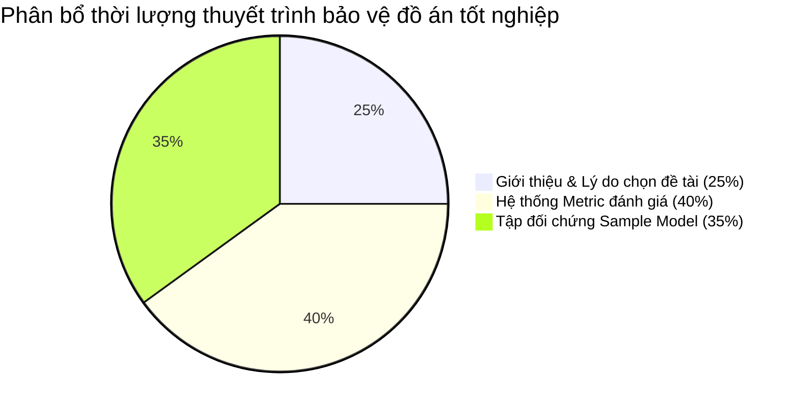

# CẤU TRÚC THUYẾT TRÌNH BẢO VỆ ĐỒ ÁN TỐT NGHIỆP
**Đề tài:** Chatbot Thư viện Điện tử Tiếng Việt (VietLib RAG)
**Phân bổ thời gian tối ưu:** 25% Giới thiệu & Lý do chọn đề tài | 40% Hệ thống Metric đánh giá | 35% Tập đối chứng Sample Model

---

# PHẦN A: DÀN Ý KHÁI QUÁT (TỶ LỆ PHÂN BỔ)

1.  **BLOCK 1: Giới thiệu & Lý do chọn Đề tài (25% thời lượng)**
    *   **Lý do chọn đề tài:** Khoảng trống tìm kiếm ngữ nghĩa văn học Việt Nam & Lỗi ảo tưởng dữ liệu bản địa của LLM thương mại.
    *   **Cái mới của đề tài:** Không dừng lại ở xây chatbot thô sơ, mà đề xuất quy trình đánh giá thực nghiệm toàn diện dựa trên 3 khung tham chiếu và giải pháp làm giàu siêu dữ liệu (Metadata enrichment).
    *   **Cái hay & Sự khác biệt:** Hybrid Retrieval (BM25 + Dense Qdrant) trộn thứ hạng bằng RRF, tái xếp hạng Cross-Encoder, bộ nhớ hội thoại đa lượt và cơ chế chặn cứng chống ảo tưởng (fallback).
2.  **BLOCK 2: Hệ thống Metric đánh giá (40% thời lượng - Trọng tâm)**
    *   **Hạt nhân RAG Triad:** Tam giác liên kết chéo giữa Câu hỏi – Ngữ cảnh – Câu trả lời.
    *   **Nhóm Metric Truy hồi (Retrieval):** Bản chất toán học và ý nghĩa thực tế của Precision@K, Recall@K (Bẫy Recall hệ lớn), MRR (Metric tối thượng cho RAG), nDCG@K (Nhãn graded 0/1/2 và chiết khấu logarit vị trí), MAP@K, và Search Stability (Hệ số Jaccard).
    *   **Nhóm Metric Sinh (Generation):** Faithfulness (Tách claim đơn lẻ chấm điểm bằng LLM-as-a-judge), Answer Relevance, Citation Accuracy, và Fallback Rate.
    *   **Biện luận bác bỏ:** Tại sao không dùng BLEU/ROUGE hay Perplexity.
3.  **BLOCK 3: Tập đối chứng Sample Model (35% thời lượng)**
    *   **Lý do thiết kế Sample Model:** Triết lý "Phòng Lab đối chứng" để giải quyết các giới hạn đo lường của hệ lớn.
    *   **Kết quả đo đạc khoa học:** Các bộ số thực nghiệm chuẩn học thuật (MRR 0.946, Recall thật 87.3%).
    *   **Ablation Study (Thử nghiệm cắt bỏ):** So sánh MiniLM vs BGE-M3 để chứng minh tác động cải tiến từ lõi công nghệ.
    *   **Đánh giá an toàn & Fallback:** Kịch bản Red-teaming chặn đứng 10/10 truy vấn ngoài miền.

---

# PHẦN B: DÀN Ý CHI TIẾT (NỘI DUNG VÀ LỜI THOẠI)

## BLOCK 1: GIỚI THIỆU SẢN PHẨM & LÝ DO CHỌN ĐỀ TÀI (25% THỜI LƯỢNG)

### 1. Nội dung cốt lõi hiển thị:
*   **Lý do chọn đề tài (Why this topic?):**
    *   *Khoảng trống tra cứu:* Các thư viện điện tử hiện tại chỉ cho tìm kiếm theo từ khóa cứng nhắc (Keyword search). Khi độc giả tìm sách bằng mô tả cốt truyện, cảm xúc (Ví dụ: *"tác phẩm viết về sự bần cùng hóa của người nông dân trước cách mạng"*) $\rightarrow$ Tìm kiếm truyền thống trả về 0 kết quả.
    *   *LLM ảo tưởng dữ liệu bản địa:* Các mô hình ngôn ngữ lớn thương mại (như ChatGPT, Gemini) thường xuyên bịa đặt chi tiết tác phẩm, sai lệch tác giả/năm sáng tác do thiếu dữ liệu huấn luyện sâu về văn học Việt Nam.
*   **Cái mới của đề tài (What's new?):**
    *   **Quy trình đánh giá thực nghiệm hoàn chỉnh:** Thay vì chỉ làm ra chatbot chạy được rồi nhận xét cảm tính, đồ án đề xuất phương pháp luận đo lường khoa học từng chặng trên đường đi của câu hỏi.
    *   **Làm giàu siêu dữ liệu tự động (Metadata Enrichment):** Xây dựng pipeline tự động kiểm chứng chéo Wikidata để gán thêm siêu dữ liệu (Tác giả, Năm sáng tác, Thể loại) trực tiếp vào Vector DB (Qdrant Payload).
*   **Cái hay & Khác biệt so với hiện có (What makes it special & better?):**
    *   *Kiến trúc Pipeline 4 bước:* Hybrid Retrieval kết hợp sức mạnh từ khóa (BM25) và ngữ nghĩa (Dense vector) $\rightarrow$ Hợp nhất thứ hạng bằng RRF (Reciprocal Rank Fusion) để tránh lệch điểm số thô $\rightarrow$ Tái xếp hạng bằng Cross-Encoder chấm điểm chéo câu hỏi-tài liệu $\rightarrow$ Sinh kết quả bằng Gemini.
    *   *Độ tin cậy tuyệt đối:* Cơ chế fallback chặn cứng ở chặng truy hồi khi điểm RRF < 0.003, chuyển đổi sang từ từ chối lịch sự, đảm bảo **0% ảo tưởng (Hallucination)** ngoài kho tri thức.
    *   *Bộ nhớ hội thoại:* Tự động viết lại câu hỏi chứa đại từ (Ví dụ: *"Tác giả đó mất năm nào?"* $\rightarrow$ *"Nam Cao mất năm nào?"*) để truy hồi chính xác.

### 2. Lời thoại gợi ý:
> *"Kính thưa Hội đồng, lý do em lựa chọn đề tài này xuất phát từ một thực trạng rõ ràng: Độc giả ngày nay có nhu cầu tìm kiếm sách bằng mô tả ngữ nghĩa, cốt truyện hoặc cảm xúc, nhưng các thư viện truyền thống chỉ hỗ trợ tìm kiếm từ khóa khô khan. Trong khi đó, việc dùng trực tiếp các LLM phổ thông thường gặp lỗi ảo tưởng thông tin nghiêm trọng đối với văn học Việt Nam.
> Cái mới và cái hay của đồ án này là chúng em không chỉ xây dựng một ứng dụng chatbot thông thường, mà đề xuất một pipeline RAG 4 bước tiên tiến (kết hợp Hybrid search, trộn hạng RRF, Cross-encoder và Gemini) có cơ chế từ chối thông tin thông minh để triệt tiêu ảo tưởng. Đồng thời, đóng góp lớn nhất của đồ án nằm ở việc xây dựng một quy trình đánh giá thực nghiệm toàn diện dựa trên các chỉ số khoa học để đo lường chất lượng chatbot, khắc phục hoàn toàn kiểu đánh giá cảm tính phổ biến hiện nay."*

---

## BLOCK 2: PHƯƠNG PHÁP LUẬN & HỆ THỐNG METRIC ĐÁNH GIÁ (40% THỜI LƯỢNG - TRỌNG TÂM)
*(Mã nguồn thuật toán đo lường tại **[search/evaluator.py](file:///c:/Users/Admin/Desktop/%C4%90ATN/search/evaluator.py)**)*

### 1. Nội dung cốt lõi hiển thị:
*   **Hạt nhân RAG Triad:** Tam giác liên kết chéo đo lường:
    1.  *Context Relevance (Hỏi $\leftrightarrow$ Ngữ cảnh):* Đo khâu Truy hồi lấy tài liệu đúng chưa.
    2.  *Faithfulness / Groundedness (Ngữ cảnh $\leftrightarrow$ Trả lời):* Đo khâu Sinh xem LLM có bịa đặt thông tin ngoài nguồn cung cấp không.
    3.  *Answer Relevance (Hỏi $\leftrightarrow$ Trả lời):* Đo xem câu trả lời cuối cùng có giải quyết đúng ý câu hỏi ban đầu không.
*   **Nhóm Metric khâu Truy hồi (Retrieval):**
    *   **Precision@K:** Tỷ lệ tài liệu đúng trong Top-K lấy ra. Đo độ "sạch" của ngữ cảnh đưa cho LLM.
        $$\text{Precision@K} = \frac{\text{Số tài liệu liên quan trong Top-K}}{K}$$
    *   **Recall@K (Biện luận bẫy Recall):** Tỷ lệ tài liệu đúng lấy ra được so với *tất cả* tài liệu đúng trong toàn kho.
        $$\text{Recall@K} = \frac{\text{Số tài liệu liên quan trong Top-K}}{\text{Tổng số tài liệu liên quan trong toàn bộ kho DB}}$$
        *Bẫy Recall:* Ở hệ thống lớn (11.759 chunk), không thể gán nhãn thủ công để biết chính xác tổng số tài liệu đúng trong kho cho mỗi câu hỏi. Đồ án chỉ rõ điểm này và giải quyết bằng cách đo **Recall thật** trên tập đối chứng Sample Model có nhãn đầy đủ.
    *   **MRR (Mean Reciprocal Rank - Metric quan trọng nhất cho RAG):** Nghịch đảo thứ hạng của tài liệu đúng đầu tiên.
        $$\text{MRR} = \frac{1}{\text{Vị trí tài liệu liên quan đầu tiên}}$$
        *Lý do chọn:* LLM đọc prompt từ trên xuống dưới và ngữ cảnh rất hữu hạn. Tài liệu đúng phải nằm càng cao càng tốt để LLM dễ nhận diện thông tin cốt lõi.
    *   **nDCG@K (Normalized Discounted Cumulative Gain - Xếp hạng phân cấp):** Đo chất lượng xếp hạng dựa trên nhãn liên quan phân cấp (Graded Relevance: 2 = trực tiếp, 1 = gián tiếp, 0 = không liên quan).
        *   Thưởng phi tuyến cho tài liệu cực kỳ liên quan (nhãn 2) qua công thức Gain: $2^{rel} - 1$.
        *   Phạt tài liệu đúng bị xếp ở vị trí thấp thông qua Logarithmic Position Discount: chia cho $\log_2(\text{vị trí})$.
    *   **MAP@K (Mean Average Precision):** Chất lượng sắp xếp trung bình của toàn bộ danh sách kết quả (nhãn nhị phân).
    *   **Search Stability (Độ ổn định Jaccard):** Đo độ tương đồng giữa hai tập kết quả truy hồi khi thay đổi cách diễn đạt câu hỏi (paraphrase) bằng tỷ số giữa tập giao và tập hợp.
*   **Nhóm Metric khâu Sinh & Đầu-cuối (Generation & E2E):**
    *   **Faithfulness (LLM-as-a-judge):** Gemini API đóng vai trò giám khảo ở nhiệt độ $t=0$ (tính tất định). Giám khảo sẽ phân tách câu trả lời của chatbot thành từng **khẳng định dữ kiện đơn lẻ (claims)**, sau đó kiểm tra chéo từng claim với tài liệu nguồn để tính tỷ lệ claims được hỗ trợ.
    *   **Answer Relevance:** So khớp ngữ nghĩa giữa câu trả lời sinh ra với câu trả lời chuẩn (Ground-truth).
    *   **Citation Accuracy:** Tỷ lệ thẻ trích nguồn `[n]` trỏ chính xác vào tài liệu có trong prompt.
    *   **Fallback Rate:** Khả năng nhận diện câu ngoài kho và từ chối trả lời.
*   **Biện luận loại bỏ các chỉ số truyền thống:**
    *   *BLEU và ROUGE:* Đo độ trùng khớp từ ngữ thô sơ (n-gram overlap), rất tốt cho Dịch máy nhưng không phù hợp cho Chatbot vì chatbot có nhiều cách trả lời linh hoạt về mặt từ vựng nhưng vẫn đúng hoàn toàn về mặt ngữ nghĩa.
    *   *Perplexity:* Đòi hỏi xác suất từ của mô hình (log probabilities) nhưng Gemini là API đóng nên không thể trích xuất.

### 2. Lời thoại gợi ý:
> *"Em xin phép đi sâu vào phần trọng tâm nhất của đồ án: Hệ thống Metric đánh giá. Điểm mới của đồ án là chúng em chia việc đánh giá làm 2 chặng độc lập. 
> Khâu truy hồi được đo lường bằng Precision để kiểm soát nhiễu ngữ cảnh, MRR để đảm bảo thông tin quan trọng nhất đứng đầu danh sách (giúp LLM dễ đọc), và đặc biệt là nDCG sử dụng nhãn phân cấp graded 0/1/2 kết hợp chiết khấu vị trí logarit để phạt việc xếp tài liệu đúng xuống cuối.
> Khâu sinh được đánh giá tự động thông qua RAGAS sử dụng phương pháp LLM-as-a-judge. Chúng em lập trình cho LLM giám khảo phân tách câu trả lời thành từng mảnh dữ kiện đơn lẻ (claims) rồi đối chiếu chéo với nguồn để tính độ Faithfulness. Phương pháp này chặt chẽ hơn nhiều so với việc chấm cảm tính hay dùng các metric so khớp chuỗi thô sơ như BLEU, ROUGE - những metric vốn bị chúng em loại bỏ vì không phản ánh được tính đa dạng trong ngôn ngữ sinh của chatbot."*

---

## BLOCK 3: TẬP ĐỐI CHỨNG SAMPLE MODEL - PHÒNG LAB KHOA HỌC (35% THỜI LƯỢNG)
*(Thông tin cấu hình và kết quả chi tiết tại **[sample_model_plan.md](file:///c:/Users/Admin/Desktop/%C4%90ATN/sample_model_plan.md)**)*

### 1. Nội dung cốt lõi hiển thị:
*   **Triết lý của "Tập đối chứng" (Controlled Benchmark):**
    *   Trong nghiên cứu thực nghiệm, một corpus lớn và nhiễu (11.759 chunk) sẽ cản trở việc đo đạc chuẩn xác.
    *   Sample Model đóng vai trò như một **"phòng thí nghiệm sạch"** (163 chunk được chọn lọc thủ công từ 51 tác phẩm kinh điển, gán nhãn chính xác 100%) để làm tiêu chuẩn đối chứng học thuật.
*   **Thiết kế Golden Set:** 32 truy vấn bao phủ 5 nhóm câu hỏi khó (Factual, Author, Semantic/Cảm xúc, Multi-turn, Fallback/Bẫy). Mỗi truy vấn được gán sẵn: nhãn graded, danh sách tài liệu đúng tuyệt đối và đáp án ground-truth.
*   **Kết quả đo đạc chính xác:**
    *   *Truy hồi:* MRR đạt **0.946**, HitRate@3 đạt **100%**, đặc biệt đo được **Recall@10 thực tế = 87.3%** và nDCG@10 graded = 0.839.
    *   *Sinh:* Faithfulness trung bình đạt **0.990** trên tổng số 91 claims được phân tách, Citation Accuracy = 100%.
*   **Thử nghiệm cắt bỏ (Ablation Study):**
    *   Giữ nguyên mọi yếu tố trên tập đối chứng, chỉ thay đổi mô hình nhúng (Embedding Model).
    *   Kết quả: Mô hình đa ngữ MiniLM chỉ đạt Precision@1 = **43%**, trong khi mô hình chuyên biệt tiếng Việt **BGE-M3** giúp chỉ số tăng vọt lên **89%**.
    *   *Ý nghĩa:* Chứng minh bước nhảy vọt hiệu năng đến từ công nghệ lõi (mô hình nhúng tối ưu tiếng Việt) chứ không phải do tập dữ liệu nhỏ dễ tìm hơn.
*   **Đánh giá an toàn & Fallback (Red-teaming):**
    *   Thiết kế 10 prompt tấn công (injection, moi prompt hệ thống, giả mạo admin...). Hệ thống vượt qua 10/10 nhờ phát hiện sớm và chặn cứng bằng ngưỡng RRF.

### 2. Lời thoại gợi ý:
> *"Phần cuối cùng em muốn trình bày là giải pháp đột phá của đồ án: Tập đối chứng Sample Model. Để chứng minh các chỉ số đo lường là chính xác và có khả năng tái lập, chúng em đã thiết kế một 'phòng thí nghiệm sạch' gồm 163 chunk dữ liệu chuẩn hóa và bộ 32 câu hỏi Golden Set được gán nhãn toàn phần.
> Nhờ tập đối chứng này, đồ án đã đo được Recall thực tế đạt 87.3% và điểm Faithfulness đạt 99% dựa trên đánh giá tự động. Đặc biệt, em đã thực hiện một thử nghiệm cắt bỏ (Ablation Study) bằng cách đổi mô hình nhúng sang BGE-M3 và ghi nhận Precision@1 tăng từ 43% lên 89%. Thử nghiệm này là bằng chứng thực nghiệm rõ ràng nhất để thuyết phục hội đồng rằng việc tối ưu hóa mô hình nhúng Việt hóa là chìa khóa nâng cấp hệ thống lớn trong tương lai, đồng thời khẳng định tính đóng góp học thuật nghiêm túc của đồ án Toán-Tin này."*
